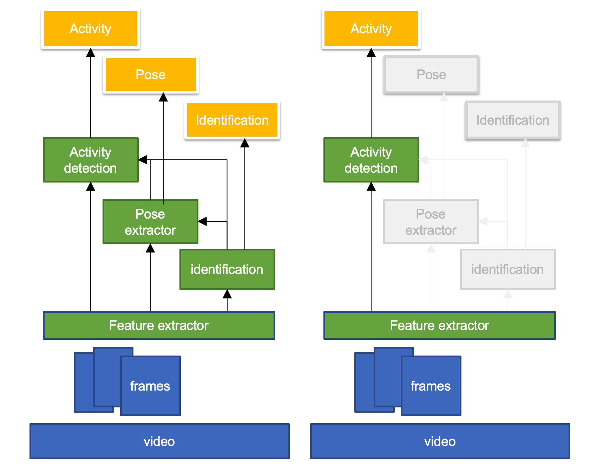
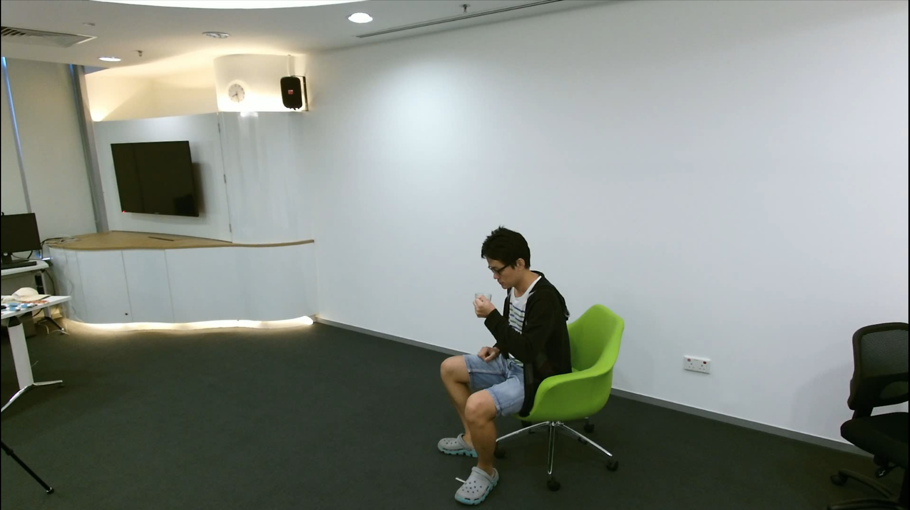
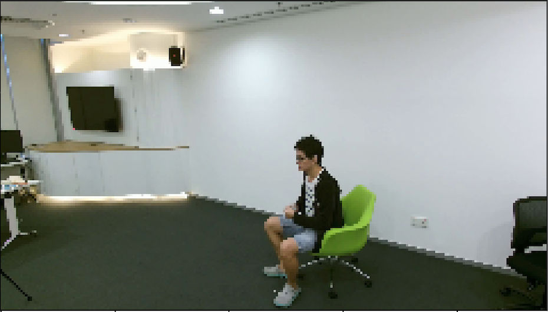
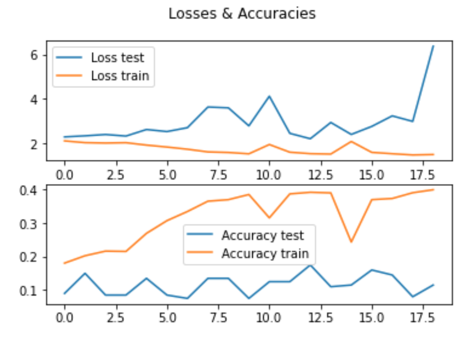
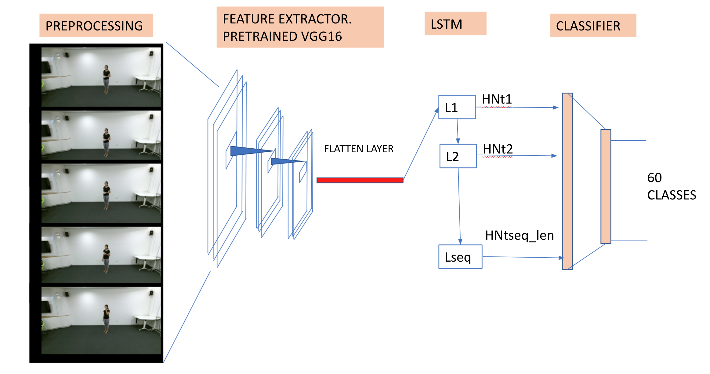
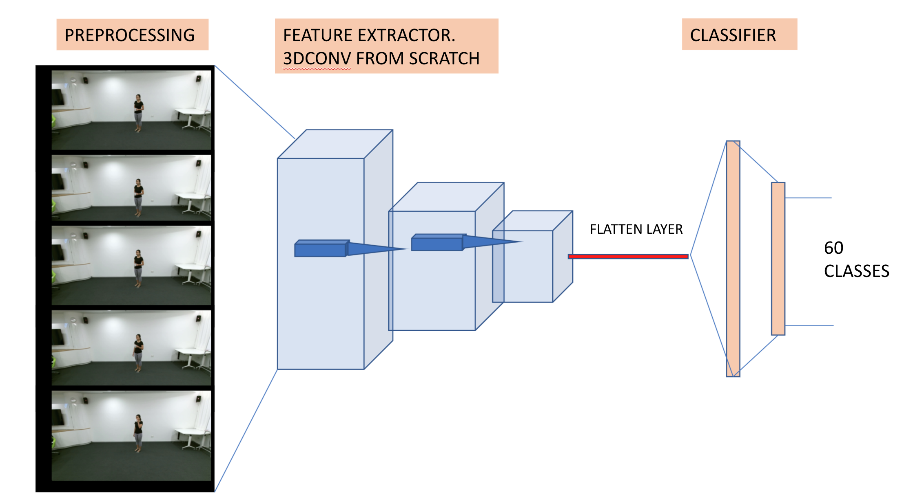
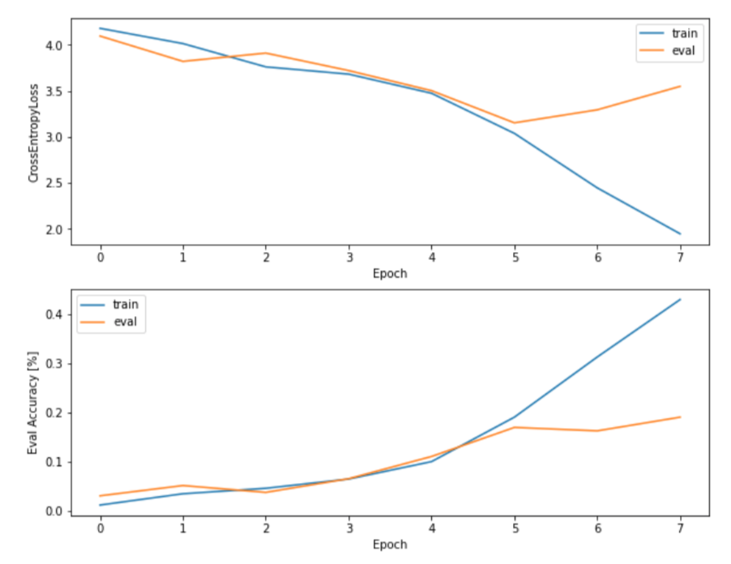
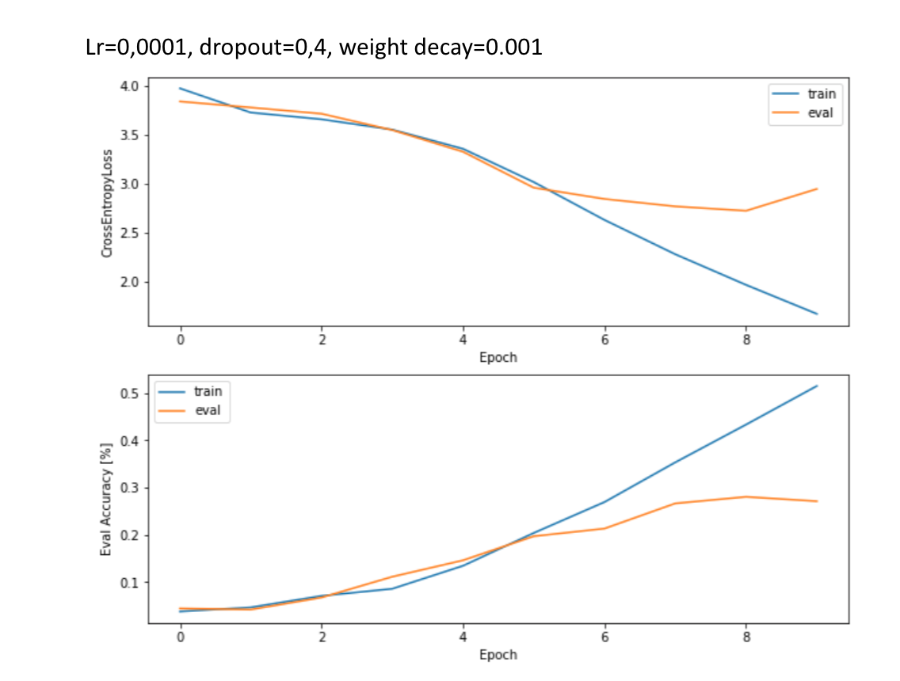
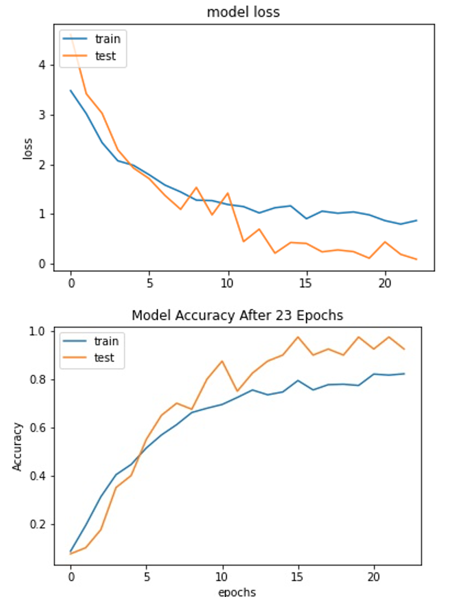

# HUMAN VIDEO ACTIVITY CLASSIFICATION
Final project for the 2020-2021 Postgraduate course on Artificial Intelligence with Deep Learning, UPC School, authored by **Khoury Boutrous**, **Oscar Calaf**, **Jeannette Hernandez**, **Jose Olivert**

Advised by **Amanda Duarte**.

Table of Contents
=================

  * [INTRODUCTION AND MOTIVATION](#introduction-and-motivation)
  * [DATASET](#dataset)
	* [NTU RGB+D](ntu-rgb+d)
	* [101](101)
  * [ARCHITECTURE AND EXPECTED RESULTS](#architecture-and-expected-results)
	 * [Video processing](#video-processing)
	 * [Multihead](#multihead)
	 * [Identification](#identification)
	 * [Pose extraction](#pose-extraction)
	 * [Classification](#classification)
  * [ENVIRONTMENT](#environtment)
  * [FIRST MODEL](#first-model)
  	 * [CONVOLUTIONAL](#convolutional)
  	 * [LSTM](#lstm)
  * [MODEL IMPROVEMENT](#model-improvement)
  	 * [TRANSFER LEARNING](#transfer-learning)
  	 * [VGG16 + LSTM](#vgg16-+-lstm)
  	 * [3DCNN Model](#3dcnn-model)
  	 * [2NETWORKS RESNET+RNN](#2networks-resnet+rnn)
  * [FUTURE](#future)	   
  * [CONCLUSIONS](#conclusions)	   
* [HOW TO](#how-to)
  	 * [OBTAIN NTU RGB+D Dataset](#obtain-ntu-rgb+d-dataset)
  	 * [HOW TO TRAIN THE MODEL](#how-to-train-the-model)
  	 * [Results folder](#results-folder)
  	 * [Installation](#installation)
---
---

## INTRODUCTION AND MOTIVATION

This project seeks to present a video classification architecture compatible with a portal device which could be scaled to real life applications. Fundamentally, is to try to determine the possibility of investigating on different Deep neural network, an architecture that 'fits' in a portable device with limited computational capacity, such as a raspberry pi or similar.
This would have many practical day to day applications such as video surveillance, crowd monitoring to mention but a few. 
The end goal is to create an autonomous device in the future, which generates valuable information and avoids transmission problems associated with videos due to the bandwidth limitations and also to consider privacy problems normally associated with present technologies.

---
---
## DATASET

### NTU RGB+D
The NTU RGB+D (or NTU RGB+D 120) Action Recognition Dataset made available by the ROSE Lab at the Nanyang Technological University, Singapore was one of the datasets used in this project. It is a very rich dataset that includes rgb videos, masked depth maps, 3d skeletons and IR data. The RGB videos was used in this project, with the intent of using a 3D skeleton dataset to subsequently learn and analyze if the system improves the action detection with such inputs.

"NTU RGB+D" contains 60 action classes and 56,880 video samples. The resolutions of RGB videos are 1920x1080. All videos are labeled by name, and  videos was taken indoors in a controlled environment (laboratory).

[More info at: ROSE](https://rose1.ntu.edu.sg/dataset/actionRecognition/)

Due to the size of the dataset, computation was very demanding. So partial loadings of the dataset was used. The distribution of classes is homogeneous, so instead of having 948 videos per class, 180 was used.
It was thought of that the reduction in the number of samples could have presented an overfeed problem, but the numbers showed  otherwise. Posing no limitation to our models even with only 50 samples.

 ]

### UFC 101
The UCF 101 data, comprising of realistic Youtube activity recognition based videos was also utilized, mainly to test the models after the NTU dataset, but secondarily to allow for inputs from different sources. The dataset is made up of 101 activities of which each activity has variant number of different videos with different subjects. With a Total of 13320 videos, a larger dataset than its predecessor, the UCF50, it has been applied to various works in literature with good results (see.Zhang HB, Zhang YX, Zhong B, Lei Q, Yang L, Du JX, Chen DS. A Comprehensive Survey of Vision-Based Human Action Recognition Methods. Sensors (Basel). 2019 Feb 27;19(5)). The  videos are categorized into 25 groups, where each video consists of 4-7 videos.

The actions are grouped as follows : (1) Human- Object Interaction (2) Body-Motion only (3) Human-Human Interactions (4) Playing Musical Intruments (5) Sports

For a more comprehensive overview of the dataset, reader is reffered to : Khurram Soomro, Amir Roshan Zamir and Mubarak Shah, UCF101: A Dataset of 101 Human Action Classes From Videos in The Wild, CRCV-TR-12-01, November, 2012. or https://www.crcv.ucf.edu/data/UCF101.php

In order to circumvent the laborous task of preprocessing, preprocessed data of fragmented videos from @inproceedings{feichtenhofer2016convolutional,
      title={Convolutional Two-Stream Network Fusion for Video Action Recognition},
      author={Feichtenhofer, Christoph and Pinz, Axel and Zisserman, Andrew},
      booktitle={Conference on Computer Vision and Pattern Recognition (CVPR)},
      year={2016}
    }, 
    consiting  of RGB images of size 1920x1080 was used. Since the use of this dataset was with a model on Google Colab pro with designated superior computational resources, the whole data set, approxiamtely 28 GB of data was used. This was to primarily avoid the occurence of overfitting due to a lack of data, thus avoiding the use of other layers that would have other wise increased the parameters of model, bearing in mind the paramount aim is to have a minimal number of parameters.

Preprocessed dataset can be downloaded online here:-
http://ftp.tugraz.at/pub/feichtenhofer/tsfusion/data/ucf101_jpegs_256.zip.001
http://ftp.tugraz.at/pub/feichtenhofer/tsfusion/data/ucf101_jpegs_256.zip.002
http://ftp.tugraz.at/pub/feichtenhofer/tsfusion/data/ucf101_jpegs_256.zip.003
-- concatenate into 1 zip file and then unzip for the folders containing all videos.

In the folders is a file containing all the associated action names which is used as the groundtruth in the architecture.

## ARCHITECTURE AND EXPECTED RESULTS

To better appreciate the proposed solutions' architectures, it is best to reiterate the original objective of the project to understand the decisions made.

The project seeks to extract results directly from a device. Therefore, all the solutions in which the video is sent to obtain some data for classifications were discarded.

This is why all the proposed solutions' aim was to work with video in the first instance. During the initial stages of the project, we valued reinforcing the results and accuracy of the system using the videos of poses as a parallel input source. That is, first an extraction of the pose would be carried out and then it would be used together with the video to improve the classification.

A solution was sought that could offer high-level results such as: *"There are 3 people: 2 are dancing and another is sitting on a chair."*

### Video processing
Normalize the video to be able to process. These hyperparameters were introduced: 

**features:** The number of elements at the end of the classificator
**videoPatterns:** Indicates the videos that it will be used in the model. It's a vector of patterns, granting an option of selecting which features to use.
**frameRate:** Avoid the use of all frames of a video. In the classification not all frames from a video was used. There exists mechanisms to compute which frames can be avoided but none of this was used. The frames were processed as per the chosen frameRate. A commonly used value is 5.
**imageResize, imageResizeWidth, imageResizeHeight** Is used to normalize the videos and the frames, reducing the original image size from 1920x1080 to 240x136 (480x272 for 3DConv)

*Original video frame, 1900x1080*

*Resized video frame, usually 240x136. Even a drastically resized image is clearly identificable*

For a sequential model such as the LSTM, frames are the required inputs. Thus video as an output from the datasetLoader is converted to vector of frames with length equivalent to the sequence of the LSTM model. 

### Frame processing
Processing the frame is basically about generating a first layer of computation on the image that allows to obtain spectral information of the frames, such that vector with length corresponding to the frames selected gives a temporal dimension to the input.

### Multihead
*The idea is to develop a 3 head network. From the one first layer we will obtain a Convolutional map of the image, and this convolutional, only done one time will be used for the real porpouses of the network.
This architecture must help to use some transfern learning from another projects, the convolutional part maybe is the most evident but with the poses could be.*

#### Identification
*Using a RNN we will force the system to identify the different subjects in a video. This layer could be the last one to implement. Meanwhile the simple case is a single scene or person. Then we can transfer that learning to the mutihead. We have two alternative methods to do the identification:* 
**Scene as identification:** It's simple but could be interesting. As we do not have dataset that give us the identification or segmentation information, we can use the videos themselves to generate videos composed of different scenes. As we are the ones who compose the scenes, it is trivial to have the expected data and thus generate a data set for training.
**Pose as identification:** Surely it is not as exact as the previous one but using the information of the pose we can generate a square that includes all the points with a certain margin. This should be able to help us even identify the person.

#### Pose extraction 
This can be a bit difficult in the case of scene generation due to the change of the coordinate axis for each video.

#### Classification
For every identification combine the pose info and the frame processing as feature vector. The qualifying part will have an LSTM. But since we have several identifications we must have a dictionary of internal states of the LSTM in order not to confuse its memory with elements of different identifications or scenes. The classification by requiring memory will force the identification to return the data ordered in such a way that it allows to recover its hidden state for each LSTM

---
---
## ENVIRONTMENT
Generating the work and selecting a convenient computational environment for the models proposed was not an easy task by all means. Majority of the time was spent on trying to resolve problems with the infrastructure provider. Although the models worked and could be run in limited environments, their magnitude was certainly not suitable for non-GPU environments.

The computation times of the videos are measured in days, not in hours and far from minutes. Performing a calculation of 10 epochs took alot of time even with only 20% of the dataset.

 In lieu of this, with GPU problems, awareness was therefore placed on the maximum capacity of the batch size, network layers and other factors used to feed the machine.

### Recomendations
Use an external disk for the dataset. In case there is the need to scale the machine, the disk can be moved to the new system and used without the cost of downloading the dataset again.

---
---
## FIRST MODEL
### CNN + LSTM
| Parameters    | Trainable parameters|
|:-------------:|:-------------------:|
| 4.194.058     | 4.194.058           |

 Starting from scratch with a classical approach to the problem, a convolutional layer to obtain a feature vector and a fully connected layer for classification was considered.
Obviously the LSTM posed alot of problems in the beginning. The LSTM was placed at the beginning of the classification with a depth equal to the number of features in our network.

Initially, there were  moments where the network learns and moments in which it apparently did not converge. Dropouts were subsequently included to avoid the first iterations from having such an effect on the network. The value of the dropout used was 0.3, but with little change. 

Adam was chosen as an optimizer starting with a conservative 0.0001 learning rate, which was varied in steps to arrive at a desirable value.
Cross entropy loss as a criterion is used since the problem is a classification.

### CONVOLUTIONAL
The convolutional part was easy to do and to process. Without GPU the video processing is a computational demanding problem. 3 convolutional layers each with a relu and a pooling layer was subsequently used.

### LSTM
The lstm was very tricky to put to work. LSTM requires a sequence or to remember the hidden state at every step. So there was a need to load the video frames in order to generate a sequence for the lstm. To get the output results from the sequential behaviour some methods were proposed.
One of the methods proposed was to allow for classification of each video frame output at each node of the LSTM, essentially a "reduction" from a result after the last sequence to a result per time. 
This help the network to obtain predictions faster, which would be helpful in real life deploiyment. But the network did not seem to learn.
subsequently after predictions were taken each node to the last node, a mean of all results from the nodes taken, in order to see if all the sequence as considered can improve the system to learn faster (the faster you do probably the loss will is smaller). This did not improve training either.
From literature, taking the last prediction from the last node is the norm, thus was used in subsequent trials.

In the future there is an intention to: Try to return all the video frames as predictions and compare which network is giving good results.

LSTM has huge memory requirements. Thus GPU is required. 
<pre><code>
        hidden = None
        for t in range(x_3d.size(1)):
            with torch.no_grad():
                x = self.resnet(x_3d[:, t, :, :, :])  
            out, hidden = self.lstm(x.unsqueeze(0), hidden) 
</code></pre>
<pre><code>
        for t in range(x_3d.size(1)):
            with torch.no_grad():
                x = self.resnet(x_3d[:, t, :, :, :])  
            convertedBatch = torch.cat([convertedBatch, x.unsqueeze(0)])

        convertedBatch = convertedBatch.permute(1, 0, 2)
        x, (self.hidden, c_n) = self.lstm(convertedBatch, self.hidden)
</code></pre>
The time required for the first solution was notably longer than the second one.

### Conclusions
The preceeding solution did not work. With our computing capacity, the batches were very small and the machine could not go futher in terms of the parameters of the network.

## MODEL IMPROVEMENT
### TRANSFER LEARNING
There exist known networks in literature used with great results in feature extraction through transfer learning. The idea was also to try to play with the number of parameters of every network, trying to find one which could fit in a personal or portable device.

 VGG16 was initially used:

### VGG16 + LSTM
| Parameters    | Trainable parameters|
|:-------------:|:-------------------:|
| 138.423.208   | 183.504.476         |

One of the first things done was to test transfer of learning from a well-known network used for classification , the VGG16.
The classifier part of the network was modified to obtain a feature vector of the images. This allowed for an analyses of the number of parameters and to compare beforehand with other smaller networks, including those specifically tailored for mobile devices such as mobilenet.

The exchange of the convolutional part was easy. Only required an update the last part of the network and to calculate the parameters between the convolutional and the classication parts.
<pre><code>
        self.vgg16 = models.vgg16(pretrained=True, progress=True)
        self.vgg16.classifier = nn.Identity()
        self.fc1 = nn.Linear(25088, n)
</code></pre>
This is a good exercise to undertake specifically if there is a need not to learn with all the vgg16 layers. So in our case we block the gradient descent during train for the vgg16 part.
<pre><code>
        for batch in batches.permute(1, 0, 2, 3, 4):
            with torch.no_grad():
                x = self.vgg16(batch)
</code></pre>

### Conclusions
Trained faster, with good results. But not able to fit in a raspberry or similar.

### 3DCNN Model
| Parameters    | Trainable parameters|
|:-------------:|:-------------------:|
| 41.828.476    | 41.828.476          |

Another approach for action classification is to use 3D Convolutional Networks. The main advantage of this model is that it is quite straightforward to apply to videos, due to the fact that video is a 3D source in itself. As we had some constraints in terms of memory, we could use only 3 convolutional layers,with kernel size 3 in the three dimensions, and a padding of 1 to avoid reducing the size in the convolutional layers. After each convolutional layer, we used pooling layers of 4 in the  height and width of the images and of 2 in the sequence length dimension.
The main disadvantage of this model is that the number of parameters is very high, so a large memory is required. In adition to that the model tends to overfit quite early. We tackled this problem by adding weight decay of 0,0001 in the optimizer and adding Dropout layers. The Dropout was tried with different values from 0,3 to 0,7. The problem of overfitting could be due to the lack of memory so we reduced the number of videos for training. Probably with the whole dataset, the problem of overfitting would be reduced or appear later (with the size used, overfitting appears in epoch 5 or 6).**

### 2NETWORKS RESNET+RNN
| Parameters    | Trainable parameters|
|:-------------:|:-------------------:|
| 26.894.184    | 26.841.064          |

### RESNET 152 +LSTM with preprocessed UCF 101 dataset
After experimenting with alterations of the aforementioned models and computational options, collab pro which gives access to specially designated faster T4 and P100 GPU instead of K80 was subsequently used. Feature extraction was carried out with a resnet152 model through transfer learning which provides independent image features of each frame in which the LSTM can capture temporal ordering and long range dependencies ultimately presenting a spatio-temporal solution. Under the presumption that the Resnet contains less parameters, its choice was motivated to invariantly speed up training to obtain a desirable result. A preprocessed dataset of the UFC101 from (Christoph Feichtenhofer, Axel Pinz, Andrew Zisserman"Convolutional Two-Stream Network Fusion for Video Action Recognition" in Proc. CVPR 2016), with characteristics as explained in the earlier section was used, thus circumventing the lubourous task associated with prepreprocessing the datasets. With computational power of the collab pro, all the data set was used first to prevent overfitting and also to test the limits of our computational power.

#### Procedure
With insights from papers, most especially the following (Quo Vadis, Action Recognition? A new model and the Kinetics Data set. J. Carreira et al 
) and (T. Cooijmans, N. Ballas, C. Laurent, and A. Courville. Recurrent batch normalization), few modifications were considered: 
(1) Consider batch normalization after the last fully connected layer of the CNN with the classifier layer removed essentially to avoid saturations that could occur in the tanh activation functions in the LSTM (2)  Resize the images to the default input of the Resnet, [3,224,224], then subsequently downsize to [3,128,128] and [3,48,48] (3) To only consider the last output of the LSTM as done in almost all works in literature.
(4) Increase the LSTM , 2 was selected and increased to 3 
With a sequence of time steps, 25 (number of frames 25), with an option to subsample, the CNN was used for a designer discretion choice of sequence of features into the LSTM. The model was trained only considering cross-enthropy loss at the end of the last time step.

#### Results
 Desirable results were obtained after 23 epochs of training and testing as shown in the figure below, from the results as shown in the loss and accuracy curves it could be realised that the model is generalised enough primarily because all the datasets was used thus tools such as drop out might not be needed, and including LSM layers to increase the depth of our model would overcomplicate the model which could inherently lead to overfitting. Thus the results was maintained as such. 

## FUTURE
IT must be said there is alot to do.
Next steps:
	Determine the best model as image feature extractor
	Move the project to a device or start training with a randomly number of jumped frames
	Try to investigate about the capacity of the network to jump frames. Can be a result of the network the number of frames to jump?
	Continue with the 3 heads development
	Train for the identification
	Train for the poses
    Undertake parallek computing to speed up training

## CONCLUSIONS
Some conclusions from our various trails can be summed up as follows:
The problems with videos are daunting to say the least. The size of the models make it difficult to deploy it in a small device like Raspberry Pi. Even though it would have been impossible with older models of Raspberry like Raspberry Pi 3, the Raspberry Pi 4 has up to 8GB of RAM so deployment of some future investigated models should not be a problem.**
But the approach to real time video processing would be similar to the used in this project. The input signal could be divided into clips of N frames and this frames would be used as input for our model. Real time can not be expected because of the processing time to pass through the network. Nevertheless, for most applications, the delay should be acceptable. For  video signals with a rate of 30 frames per second and sampling of one frame out of 5, 6 frames per second could be preprocessed. Taking a sequence length of 16, it would take around 3 seconds to classify an action. For applications where real time is critical it would not be good enough but in many other cases could be useful for the system.
Probably in real life applications, the problem would be much more simple than classifying among 60 classes. In many cases the problem would become a binary classification problem. For example understanding if somebody is following the health and safety meassures when using a machine or when climbing a telecommunictations tower, or investiagting weather movement of a mechanical part are signs of a fault or not. Probably in these cases better results in terms of accuracy with small models that can be deployed in a small device.
******************
                   But the possibilities are bigger now that just the beginning.

## HOW TO
    
### OBTAIN NTU RGB+D Dataset
Go to [Rose page](https://rose1.ntu.edu.sg/dataset/actionRecognition/) and start the access request

### HOW TO TRAIN THE MODEL
Edit main.py and configure the hyperparameters.
You must revise the parameter videoPatterns, it's a vector to filter the videos used by the system.
Example for all videos: 
	["/data/nturgb+d_rgb/*.avi"]

Example for only the first 3 features:
	["/data/nturgb+d_rgb/*01_rgb.avi", "/data/nturgb+d_rgb/*02_rgb.avi","/data/nturgb+d_rgb/*03_rgb.avi"]

run the main.py to do the train

### Results folder
On the results folder will appear files {modelname}.*
.log file explains the process
.pt is the model
.train .test are the values of the losses and accuracies during the train

Remember that the .pt file allows you to do a continuos execution. So if the system crash you can continue the execution only starting the main.py file. If you want to start from zero then delete all the files {modelname}.* from the folder results

#### Installation
Install conda and run pip install -r requirements.txt
We used Deep Learning VM from cloud.google.com. 

   